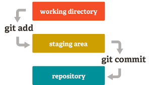
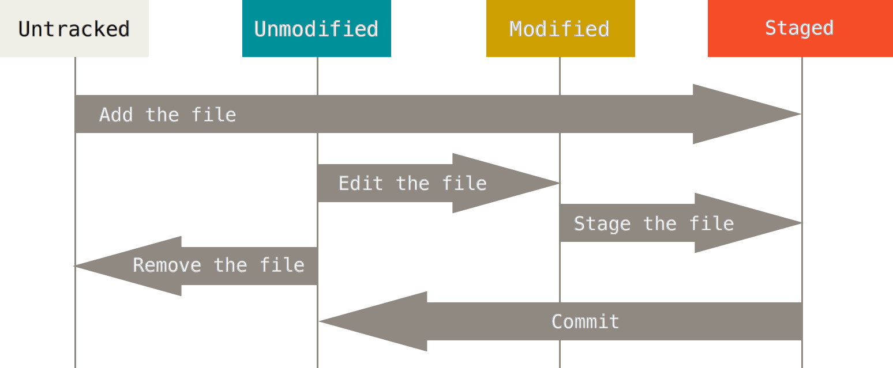

# Découverte de Git

## La brève introduction

### La gestion de versions

### Les systèmes de gestion de versions

Les systèmes de gestion de versions (ou *VCS*) sont utilisés pour faciliter la gestion de versions. En outre, ils vous permettront de :

* enregistrer les modifications apportées à un projet,
* visualiser les changements à travers le temps,
* revenir à un état précédent,
* détecter plus facilement les modifications porteuses d'erreurs.

Les *VCS* diminuent la crainte du changement et permet de revenir à un état stable du projet à n'importe quel moment.

#### Les types de *VCS*

Il existe plusieurs types de *VCS* :

* les ***VCS* centralisés** ou *CVCS* (Subversion, Perforce, ...) : ce type de *VCS* fournit un dépôt central situé sur un serveur sur lequels les contributeurs du projet peuvent se connecter, et extraire ses fichiers pour les modifier. L'inconvénient de ces systèmes est justement la centralisation du dépôt qui, en cas d'indisponibilité du serveur central, peut empêcher les contributeurs du projet de travailler.


* les ***VCS* décentralisés** ou *DVCS* (*Git*, *Mercurial*, ...) : ce type de *VCS* pallient aux inconvénients des *CVCS*. La mise à jour des fichiers ne passe plus par l'extraction de ces fichiers, mais par la duplication même du dépôt. Chaque contributeur peut travailler indépendamment des autres contributeurs et sans connexion permanente avec le serveur central.


___

## Et c'est parti ! (Installation et configuration)

### Installation

Pour Windows, vous pouvez télécharger Git sur le [site officiel](http://git-scm.com).
Pour Linux, vous pouvez passer par un `sudo apt install git-all`.

Une fois l'installation terminée, ouvrez un terminal et tapez `git --version`. Vous devriez avoir une réponse du type :

```bash
$ git --version
git version 2.15.1.windows.2
```

### Quels outils pour utiliser Git

Idéalement, nous privilégierons le **terminal de commande**. Il existe une multitude d'outils graphiques facilitant l'utilisation de Git, mais, dans une grande majorité des cas, ces derniers ne supportent l'entiéreté des commandes et options possibles en ligne de commande.

Dans un premier temps, il sera préférable d'apprendre par la ligne de commande avant d'utiliser une interface graphique servant de surcouche, pour mieux appréhender et comprendre l'intérêt et les possibilités de Git.

Vous trouverez tout de même une [liste d'outils graphiques](#liste-doutils-graphiques) à la fin de ce TP.

### Première configuration

Git trace les changements apportés par les différents contributeurs d'un projet. Pour pouvoir apporter des changements à un projet, il est nécessaire de fournir votre identité, à savoir :

* un prénom et nom (ou pseudo)
* une adresse mail

```bash
$ git config --global user.name "John Doe"
$ git config --global user.email johndoe@example.com
```

Il s'agit de la configuration minimale obligatoire pour utiliser Git. Néanmoins, certaines configurations de base peuvent vous être utiles :

```bash
$ git config --global core.editor vim  ## Configurer l'éditeur de texte pour éditer les messages de commit.
```

___

## Démarrer sur un projet

Il existe deux manières pour commencer à travailler sur un dépôt Git :

* Initialiser un nouveau projet.
* Cloner un projet existant.

### Initialiser un nouveau dépôt

Un dépôt Git (ou *Git repository*) est un simple répertoire contenant un dossier *.git*. Cependant, ce répertoire n'est pas créé manuellement par l'utilisateur. Il est généré par la commande `git init`.

> **Manipulation** : Pour créer un dépôt Git, créez un répertoire sur votre poste, placez-vous à l'intérieur et exécutez la commande suivante.
>
> ```bash
> $ git init
> ```

### Cloner un dépôt existant

Il existe des plateformes permettant le stockage et la gestion du code source versionné avec Git ([GitHub](https://github.com/), [GitLab](https://about.gitlab.com/), [BitBucket](https://bitbucket.org/), ...). Elles donnent accès librement ou non aux projets publiés sur celles-ci, et il est possible de contribuer à ces projets en les clonant.

Ce sujet de TP est d'ailleurs versionné avec Git, et libre d'accès. Nous allons le cloner, et l'utiliser pour la suite de ce TP.

> **Manipulation** : Clonez ce projet : `git clone https://github.com/sjaupart/git-init.git`
>
> Vous devez avoir un résultat de ce type :
>
> ```bash
> $ git clone https://github.com/sjaupart/git-init.git
> Cloning into 'git-init'...
> remote: Enumerating objects: 223, done.
> remote: Total 223 (delta 0), reused 0 (delta 0), pack-reused 223R
> Receiving objects: 100% (223/223), 27.91 KiB | 277.00 KiB/s, done.
> Resolving deltas: 100% (39/39), done.
> ```

Le clonage a créé un répertoire *git-init* qui est notre dépôt Git.

> **Information** : En dehors des commandes `config`, `init` et `clone`, les commandes Git ne peuvent s'exécuter que dans un dépôt Git. Une commande Git exécutée hors dépôt vous enverra ce message explicite :
>
> $ git log
> fatal: Not a git repository (or any of the parent directories): .git

___

## Utilisation basique

Dans cette partie, nous allons aborder les commandes permettant une utilisation de base de Git (nous n'aborderons pas encore la gestion des branches et la collaboration entre contributeurs d'un même projet).

Nous verrons comment :

* consulter l'historique d'un projet,
* différencier deux versions à un instant T,
* publier un changement.

### Analyser l'historique du projet

Précédemment, vous avez cloné ce sujet de TP sur votre poste. Nous allons consulter son historique pour connaître les changements apportés à ce projet.

> **Manipulation** : Exécutez la commande
>
> ```bash
> $ git log
> ```

L'historique affiché vous montre l'ensemble des changements apportés au projet et classés de manière antichronologique.

```bash
$ git log
commit ca82a6dff817ec66f44342007202690a93763949
Author: Scott Chacon <schacon@gee-mail.com>
Date:   Mon Mar 17 21:52:11 2008 -0700

    changed the version number

commit 085bb3bcb608e1e8451d4b2432f8ecbe6306e7e7
Author: Scott Chacon <schacon@gee-mail.com>
Date:   Sat Mar 15 16:40:33 2008 -0700

    removed unnecessary test
```

Chaque bloc apparaissant dans l'historique correspond à un **commit** (ou *instantané* en français, nous utiliserons néanmoins le terme *commit* pour le reste du TP).

Un *commit* est caractérisé par :

* un **identifiant** (une chaîne de 40 caractères hexadécimaux appelé **empreinte SHA-1**),
* un **auteur**,
* une **date de création**,
* un **message explicatif** (rédigé par l'auteur),
* un **ensemble de changements** (non affiché par défaut).

> **Manipulation** : Plus concrètement, pour afficher l'historique avec le détail des changements pour chaque fichier du projet, ajoutez l'option `-p` à la commande précédente.
>
> ```bash
> $ git log -p
> ```
>
> Les changements sont représentés par des ajouts et suppressions de lignes (caractérisés respectivement par des `+` et des `-` au début de chaque ligne modifiée).

On a tendance à privilégier l'usage d'outils graphiques à la ligne de commande pour la consultation de l'historique d'un projet. En ligne de commande, et même sans l'option `-p`, le `log` peut être assez verbeux. Néanmoins, cette commande possède un très grand nombre d'options pour simplifier l'affichage, rechercher des informations, ... et il est profitable de l'associer avec certaines options.

Parmi les options les plus importantes à utiliser avec la commande `log`, nous avons :

* `--oneline` : affiche les informations d'un *commit* sur une ligne.
* `--graph` : affiche l'historique du projet sous forme de graphe (utile pour l'affichage des différentes branches que nous verrons dans la suite de ce TP).
* `--decorate` : affiche le nom des références (branches, tags, ...) dans l'historique.
* `--abbrev-commit` : limitant la taille des SHA-1 de *commit* à 7 caractères au lieu de 40 (les 7 premiers caractères étant suffisants à l'identification d'un *commit*).

> **Manipulation** : Exécutez la commande `git log` en associant les différentes options citées ci-dessus. Vous constaterez que seules les informations utiles à l'affichage sont présentées.

### Utilisation des alias

Dans la section précédente, nous avons vu comment consulter l'historique d'un projet avec `git log` et ses options. Cependant, il est incommode de saisir cette commande avec ses options à chaque fois juste pour une consultation d'historique. Git simplifie l'usage de ses commandes, notamment par la création d'**alias**.

> **Manipulation** : Prenons la commande suivante stylisant le `log` :
>
> ```bash
> $ git log --graph --date=relative --pretty=tformat:'%Cred%h%Creset -%C(auto)%d%Creset %s %Cgreen(%an %ad)%Creset'
>```
>
> Même si, plutôt que de retaper entièrement la commande, vous faites une recherche de celle-ci via un [`history`](https://mediatemple.net/community/products/dv/204404624/using-the-history-command), cela reste peu pratique. A la place, privilégiez la création d'un alias.
>
> **Manipulation** : Créez un alias `lg` :
>
> ```bash
> $ git config --global alias.lg "log --graph --date=relative --pretty=tformat:'%Cred%h%Creset -%C(auto)%d%Creset %s %Cgreen(%an %ad)%Creset'"
>```
>
> Cette commande crée un alias `lg` pour la commande `log` customisée.
>
> **Manipulation** : Vous pouvez exécuter la commande `git lg` et constater la bonne configuration de l'alias.

> **Information** : A noter que les configurations Git possibles grâce à la commande `config` peuvent être définies à différents niveaux : **global**, **system** et **local**. Nous n'utiliserons que la configuration globale pour ce TP.

### Où suis-je positionné dans l'historique

L'historique affichable par la commande `log` liste les changements apportés à un projet dans le temps. Avec un *VCS*, nous savons que nous pouvons revenir à un état précédent dans le dépôt, mais encore faut-il savoir où on se trouve.

Si vous exécutez la commande `git lg` créée précédemment, vous verrez dans l'historique une référence `HEAD` définissant l'endroit où nous nous trouvons dans le projet. Généralement, la référence `HEAD` pointe sur une branche (`master`, ...) ou un tag, mais nous détaillerons ça plus tard.

### Créer un commit

Nous savons désormais consulter l'historique de ce projet. Dans cette section, nous allons apprendre à versionner des changements que vous allez faire sur ce projet.

#### Les différents états d'un fichier

Sous Git, il existe trois grands états dans lesquels les fichiers peuvent se trouver :

* le **répertoire de travail** (*working directory*) : contient les changements que vous avez apportés au projet. Il correspond à votre travail en cours.
* l'**index** (*staging area*): recense toutes les modifications des fichiers prêtes à être versionné.
* l'**historique** ou le **dépôt** (*repository*) : contient l'ensemble des commits du projet.



> **Manipulation** : Pour consulter l'état courant du dépôt, vous pouvez utiliser la commande :
>
> ```bash
> $ git status
> ```

Cette commande classera les modifications de fichiers en trois sections :

* les **fichiers enregistrés dans l'index** (*changes to be committed* ou *staged*) : géré par l'index, donc prêt à être versionné,
* les **fichiers en cours de modification** (*changes not staged for commit* ou *modified*) : recense les modifications qui diffèrent de l'index, donc en cours de travail,
* les **fichiers non suivis** (*untracked files*) : concerne tous les nouveaux fichiers inconnus (non versionnés) du dépôt.



> **Manipulation** : Modifiez n'importe quel fichier de ce projet, et lancez un `git status`.
>
> Le fichier modifié apparaîtra dans le répertoire de travail.

#### Versionner un changement

> **Information** : Vous serez amené à saisir des messages de commit. Si vous souhaitez utiliser un éditeur de texte particulier, vous pouvez utiliser la commande suivante :
>
> ```
> $ git config --global core.editor vim  ## pour utiliser Vim
> $ git config --global core.editor nano ## pour utiliser Nano
> etc...
> ```

Si vous avez modifié un fichier d'un dépôt Git, celui-ci apparaîtra dans le répertoire de travail. Les fichiers apparaissant à cet endroit peuvent être ajoutés à l'index et versionné grâce à la commande `git commit`.

> **Manipulation** : Ajoutez le fichier modifié à l'index :
>
> ```bash
> $ git add README.md
> ```
>
> Le fichier *README* est ajouté à l'index. Vous pouvez vérifier cela grâce à un `git status`.
>
> Le fichier peut être versionné :
>
> ```bash
> $ git commit
> ```
>
> Un éditeur par défaut est censé s'ouvrir pour vous permettre de saisir votre message de commit. Saisissez-le, enregistrez-le et fermez l'éditeur.
>
> Le commit est créé.
>
> Vous pouvez consulter l'historique et voir qu'il a bien été créé.

___

## Gestion des branches

## Partage et mise à jour

## En supplément...

### Liste d'outils graphiques

* Git GUI (Windows, Linux, MacOS)

## Glossaire

* **Dépôt** : Répertoire géré par un *VCS* permettant le stockage et le contrôle des versions d'un ensemble de fichiers.
* **VCS** (*Version Control System*) : Outil utilisé pour la gestion de version.

## Référence

* [Site officiel de Git](https://git-scm.com)
* [Pro Git Book](https://git-scm.com/book/fr/v2)